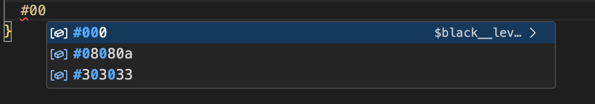
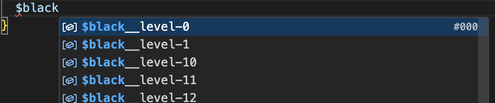

# scss-variable-completions README

输入 `#颜色值` 或 `$变量` 时，提示对应的 scss 变量
输入 `#颜色值` 或 `var()` 时，提示对应的 css 变量

## Extension Settings

* `scss-variable-completions.variableScssPaths`: 配置scss文件路径。如: ["relative/path/to/file.scss"]
* `scss-variable-completions.variableCssPaths`: 配置css文件路径。如: ["relative/path/to/file.css"]
* `scss-variable-completions.variableCssTheme`: 配置css文件中需要提示的主题。如: "dark" 或者 "light"

## Use

or

