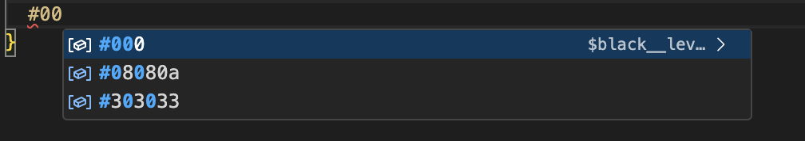

# scss-variable-completions README

This is the README for your extension "scss-variable-completions". After writing up a brief description, we recommend including the following sections.

## Extension Settings

* `scss-variable-completions.variableScssPaths`: 配置scss文件路径。如: ["relative/path/to/file.scss"]

## Use

or

